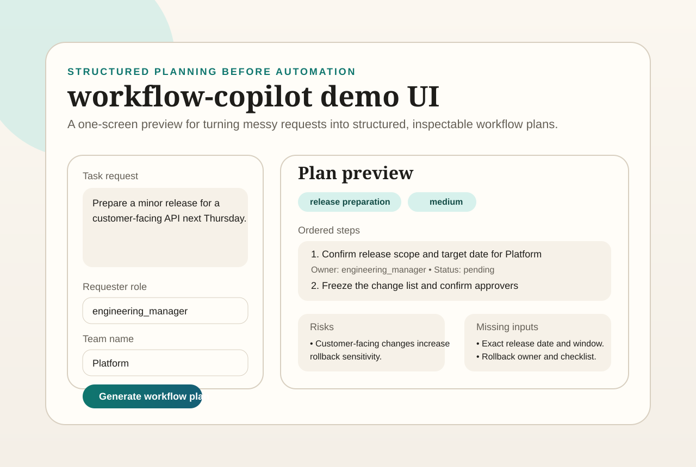

# workflow-copilot

[](https://github.com/OfficialJCastillo/workflow-copilot/actions/workflows/ci.yml)

A lightweight workflow planning API for turning messy operational requests into structured steps, owners, risks, and follow-up actions.

## Overview

`workflow-copilot` is a narrow, product-facing v1 for teams that need clearer execution plans before they automate anything. Instead of directly calling external tools, this version focuses on workflow decomposition:

- accept a natural-language task request
- infer a workflow category
- generate ordered action steps
- identify missing inputs and execution risks
- suggest checkpoints and success criteria
- expose the result through a small FastAPI service and tiny browser demo

This repository is intentionally scoped to deterministic local logic so it stays easy to review, test, and publish.

## Demo Snapshot

Tiny browser demo preview:



## V1 Scope

- Local FastAPI service
- Deterministic workflow planning with no hosted dependencies
- SQLite-backed workflow persistence for saved plans and step updates
- Workflow categories for onboarding, incident response, release prep, vendor approval, and recurring operations
- Structured response schema with steps, blockers, risks, and follow-up questions
- Simple urgency and risk heuristics
- Tiny demo UI for previewing live plan responses at `GET /`
- Smoke tests for the API-facing pipeline

## Architecture

```text
workflow-copilot/
├── app/
│   ├── api/
│   ├── schemas/
│   └── services/
├── tests/
├── README.md
├── requirements.txt
└── main.py
```

## Example Workflow

1. Send a task request such as "Prepare a minor release for a customer-facing API next Thursday."
2. Open the browser demo or call the API directly.
3. The service classifies the request into a workflow type.
4. It returns an ordered plan with owners, dependencies, risks, and success checks.
5. A caller can render the plan in a UI, ticketing flow, or internal tool.

## How To Run

```bash
python -m venv .venv
source .venv/bin/activate
pip install -r requirements.txt
uvicorn main:app --reload
```

Open the tiny browser demo after starting the server:

```text
http://127.0.0.1:8000/
```

## API Endpoints

- `GET /` (tiny demo UI)
- `GET /health`
- `POST /workflow/plan`
- `POST /workflow/plans`
- `GET /workflow/plans`
- `GET /workflow/plans/{workflow_id}`
- `PATCH /workflow/plans/{workflow_id}/steps/{step_id}`

## Tiny Demo UI

The root page provides a lightweight one-screen flow to:

- enter an operational request
- set requester role and team name
- preview the live structured plan response from `POST /workflow/plan`
- inspect steps, risks, missing inputs, follow-up questions, and success checks without using a separate API client

## Example Response

```json
{
  "workflow_id": "wf-3f6fd803523a",
  "workflow_type": "release_preparation",
  "summary": "Plan a controlled release with approvals, validation, and rollback readiness.",
  "steps": [
    {
      "step_id": "step-1",
      "title": "Confirm release scope and deadline",
      "owner": "requester",
      "status": "pending"
    }
  ],
  "risks": [
    "Customer-facing changes increase rollback sensitivity."
  ],
  "missing_inputs": [
    "Exact release date and deployment window."
  ]
}
```

## Design Notes

- The service is intentionally deterministic so the output is inspectable and stable.
- The workflow categories are implemented as lightweight templates plus request-specific heuristics.
- SQLite persistence makes the scaffold usable for saved workflows, step tracking, and simple product demos even before adding an LLM-backed planning layer.
- The tiny browser demo is intentionally read-only and previews the existing planning response without creating or mutating saved plans.

## GitHub Setup Notes

Suggested repo description:

`Structured workflow planning API for turning messy operational requests into ordered steps, risks, and follow-up actions.`

Suggested topics:

- `workflow`
- `planning`
- `fastapi`
- `python`
- `sqlite`
- `operations`
- `productivity`

## Roadmap

- add calendar-aware due date handling
- add user and team assignment rules
- add Slack/Jira adapter examples
- add optional model-backed rewrite and follow-up generation
